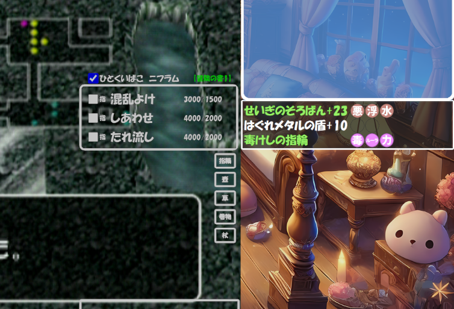

## Overview / 概要
 
T3WS is a web-based gadget for Toruneko’s Great Adventure 3: Labyrinth of Another World, 
focusing on managing and displaying weapons, shields, and rings with optional stamps (印). 
It runs locally on your browser and can be used as an overlay in streaming tools like OBS. 
 
本ツール T3WS は、トルネコの大冒険３【異世界の迷宮】 において、 
武器・防具・指輪の情報を管理・表示するためのウェブベースのガジェットです。 
ローカルのブラウザで動作し、OBS などの配信ツールに重ねて表示できます。 

Capture this tool’s window or browser source in the corner of your gameplay screen. 
Apply a color key or chroma key to the background to make it transparent. 
ゲーム画面の片隅に本ツールのウィンドウ（またはブラウザソース）を取り込み、 
背景色をカラーキーやクロマキーで透過させることで、配信画面に重ねられます。 
 
## Features / 特徴 
Weapon & Armor Display / 武器・防具の表示 
Each item is dynamically loaded from an embedded CSV. 
アイテム情報は埋め込み CSV から動的に読み込まれます。 
 
Stamps / 合成印の管理 
You can add or remove stamps (印) on weapons, armor, or rings, and the display updates accordingly. 
武器や防具、指輪に印を付与・解除する機能を備えています。 
 
Local Save / ローカル保存 
All changes are automatically saved to your browser’s localStorage. 
変更内容はブラウザの localStorage に自動保存されます。 
 
Minimalistic Overlay / シンプルなオーバーレイ 
Designed for streaming overlays with minimal space usage. 
配信画面に重ねやすいシンプルなデザインです。 
 
No Server Needed / サーバ不要 
This is a static web application; simply open the HTML file in your browser. 
静的なウェブアプリケーションのため、HTML を開くだけで動作します。 
 
## How to Use / 使い方 
Download or Clone / ダウンロードまたはクローン 
Obtain the repository as a ZIP or clone it locally. 
ZIP ファイルをダウンロードするか、リポジトリをクローンしてください。 
 
Open in Browser / ブラウザで開く 
We recommend Google Chrome for best compatibility. 
If you have HGP創英角ﾎﾟｯﾌﾟ体 installed, open index.html; otherwise, use indexmeiryo.html. 
 
Google Chrome での利用を推奨します。 
HGP創英角ﾎﾟｯﾌﾟ体 がインストールされていれば index.html、 
そうでなければ indexmeiryo.html を開いてください。 
 
## Configure & Use / 設定と利用 
 
Select weapons, armor, or rings from the embedded CSV. 
 
Manage stamps (合成印) by clicking on the stamp icons. 
 
Changes are saved automatically. 
 
CSV に含まれる武器・防具・指輪を選択。 
 
アイコンをクリックして合成印を追加・削除。 
 
変更は自動保存されます。 
  
Stream Overlay / 配信への活用 
 
Capture this in OBS as a window or browser source. 
 
Use color key / chroma key on the background to make it transparent. 
 
OBS などでウィンドウまたはブラウザソースとして取り込み、 
 
背景色をキーイングして透過させることで、ゲーム画面上に重ねられます。 
 
## Installation / インストール 
No installation is required. This is a static web app, so open the HTML file in your browser. 
特別なインストールは不要です。静的なウェブアプリケーションのため、 
HTML ファイルをブラウザで開くだけで動作します。 
 
## Contributing / コントリビュート 
If you have suggestions or improvements, feel free to fork the repository and create a pull request. 
改善案やご提案があれば、リポジトリをフォークしてプルリクエストをお送りください。 
 
## License / ライセンス 
This project is released under the MIT License. 
本プロジェクトは MIT ライセンス の下で公開されています。 
 
## Acknowledgments / 謝辞 
Original Author: じぇいつぅ 
Twitter (X): @iidx_j2 
You are free to use this tool for any purpose, including commercial streaming and ad revenue, without special permission. However, please do not falsely claim that you developed this tool yourself. 
本ツールは、配信や広告収入などの商業利用を含むあらゆる用途で、 
特別な許諾なくご利用いただけます。 
もし可能であれば、下記のクレジット表示をしていただけると大変ありがたく存じます。 
 
じぇいつぅるず「T3DB」 
X: @iidx_j2 
 
